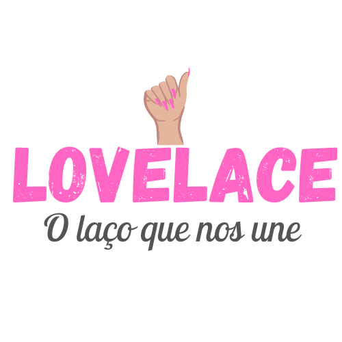
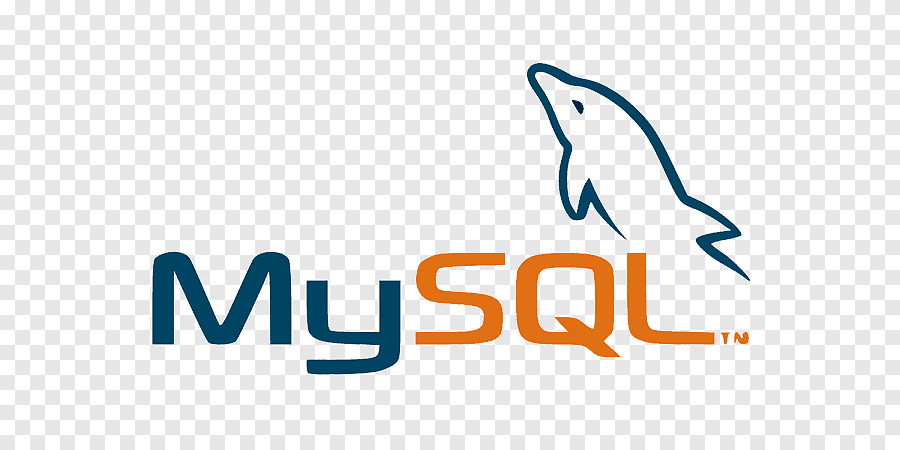

# LOVELACE

A Lovelace consiste em um aplicativo multiplataforma (web e mobile) voltado
para o mercado de serviços de beleza, tais como: cabeleireiros, manicures,
pedicures, entre outros. Ele permite o cliente realizar o agendamento de
consultas nos estabelecimentos de forma remota, sendo possível escolher o
dia, a data e o local. O profissional pode cadastrar os salões, podendo ter mais
de um cadastrado em sua conta. Há também um chat para a comunicação e
negociação entre os clientes e profissionais, agilizando assim o atendimento
para ambas as partes.

Site construido para o projeto integrador de 2023 da FATEC Carapicuiba!

### 🛠 Ferramentas Utilizadas:
 

   
  
  

#

- 📌 Em progresso.

- 🛠 APP feito em FLUTTER e DART.

- 🔗sem link no momento
